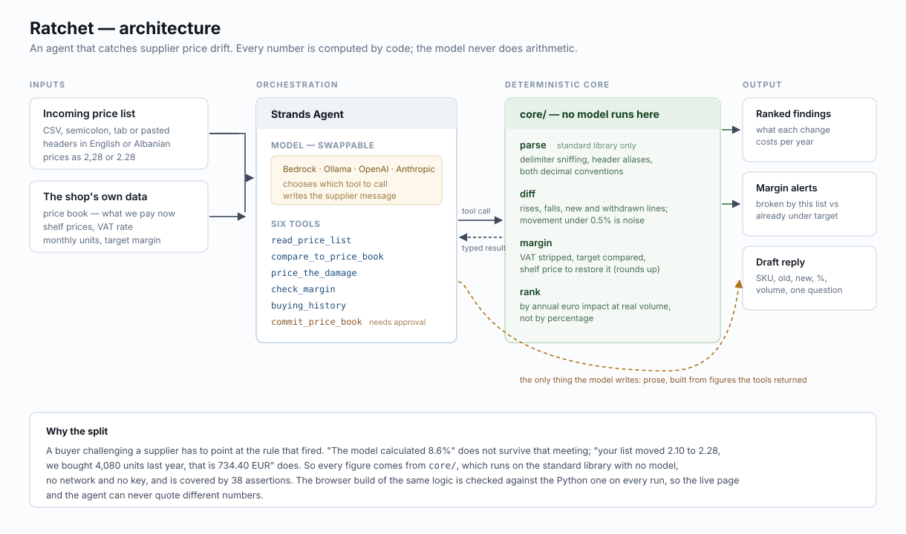

# Ratchet

**Supplier prices only move one way. This agent notices.**

Built for the [Agents for Humans Hackathon](https://agentsforhumans.devpost.com/) with the
[Strands Agents SDK](https://strandsagents.com/). Track: **Professional Agents**.

- **Live demo:** https://ramadandurguti.github.io/agents-for-humans/
- **Architecture:** [`docs/architecture.svg`](docs/architecture.svg)

---

## The problem

A small shop buys from a handful of distributors. Every month or quarter a new price list
arrives — a CSV exported from Excel, a table pasted out of a PDF, headers in whatever
language the supplier uses, prices written `2,28` or `2.28` depending on who typed them.

Nobody compares it line by line against the last one. There are two hundred lines and one
person doing the ordering. So a supplier moves forty items up six percent and it is not
noticed for a year. The margin bleeds and nobody can say when it started.

The comparison is not hard. It is just tedious, repetitive, and needs doing every single time
a list arrives — which is exactly the shape of work worth handing to an agent.

## What Ratchet does

Give it the list that just arrived. It:

1. **Reads it** — whatever the delimiter, whatever the header language, either decimal convention.
2. **Diffs it** against the price book, ignoring movements under 0.5% as rounding noise.
3. **Prices the damage** — ranks every movement by what it costs *per year at real sales volume*.
4. **Checks margins** — flags lines that fall below target, and says which the new list broke
   versus which were already under.
5. **Drafts the reply** — SKU, old price, new price, percentage, volume, one specific question.

It does **not** overwrite the price book unless you approve it. Committing silently would
destroy the history that makes the next comparison possible.

### On the bundled sample — one supplier, 14 lines

```
Annual exposure       4,417.20 EUR   (8 lines up)
Recovered               118.80 EUR   (1 down)
Net effect            4,298.40 EUR   per year at current volumes
Margin broken                 7      (0 were already under)

SKU    ITEM                          WAS    NOW    MOVE     EUR/YR  MARGIN
4477   Kafe e bluar 200g            1.86   2.04   +9.7%    +928.80  BROKEN
4476   Qumesht UHT 1L               0.71   0.74   +4.2%    +756.00  BROKEN
4471   Vaj luledielli 1L            2.10   2.28   +8.6%    +734.40  BROKEN
4473   Sheqer 1kg                   0.79   0.86   +8.9%    +512.40  BROKEN
4478   Vaj ulliri 750ml             5.90   5.72   -3.1%    -118.80  32.2%
```

Look at the ranking. The milk moved **4.2%** — the smallest rise on the list — and it is the
**second most expensive thing that happened**, because the shop sells 25,200 units of it a year.
The coffee moved 9.7% and costs less than you would guess from the percentage. Sorting by
percentage puts the wrong line at the top of the page. Sorting by money does not.

## Architecture: deterministic core, model at the edge



**Every number comes from code. The model never does arithmetic.**

The model picks which tool to call and writes the message to the supplier. That is all. Each
margin, percentage and annual figure is produced by `core/`, which runs on the Python standard
library with no model, no network and no key.

This is not a cost saving, it is a usability requirement. A buyer challenging a supplier has to
point at the rule that fired. *"The model calculated 8.6%"* does not survive that meeting.
*"Your list moved 2.10 to 2.28, we bought 4,080 units last year, that is 734.40 EUR"* does.

### The six tools

| Tool | What it returns |
| --- | --- |
| `read_price_list` | Parsed rows, plus how many were skipped as unreadable |
| `compare_to_price_book` | Every SKU that rose, fell, appeared or was withdrawn |
| `price_the_damage` | Findings ranked by annual euro impact, with totals |
| `check_margin` | What one cost does to one product's margin, and the shelf price to fix it |
| `buying_history` | Current cost, shelf price, volume and target for one SKU |
| `commit_price_book` | Accepts the new list as baseline — only after approval |

### Two implementations, held to the same numbers

`core/` (Python) is canonical — it is what the agent calls. `web/core.js` mirrors it so the
live page runs the real pipeline in your browser with nothing installed and no key.

`tests/parity.mjs` runs the browser build over the same inputs as the Python build and asserts
the outputs are **identical**. If the two ever drift, that fails — so the live page and the
agent can never quote different figures.

## Running it

```bash
git clone https://github.com/RamadanDurguti/agents-for-humans
cd agents-for-humans
```

**The deterministic review needs nothing at all** — no install, no key, no network:

```bash
python3 -m agent.run review samples/alfa-june.csv samples/alfa-september.csv \
  --supplier "Alfa Distribution"
```

**The agent** needs the SDK and a model:

```bash
pip install strands-agents strands-agents-tools

# free and local — no account of any kind
RATCHET_PROVIDER=ollama RATCHET_MODEL=llama3.1 \
  python3 -m agent.run ask "what did the coffee do, and should I push back?"

# or Bedrock (default), OpenAI, Anthropic
RATCHET_PROVIDER=bedrock AWS_REGION=us-west-2 python3 -m agent.run ask "..."
```

`RATCHET_PROVIDER` is the only thing that changes between them. The agent code is identical.

### Tests

```bash
python3 tests/test_core.py    # 38 assertions over parsing, margins, diffing, ranking
node tests/parity.mjs          # browser build, compared against the Python output
```

## Layout

```
core/        parse, diff, margin maths, ranking — standard library only
agent/       six Strands tools, provider selection, CLI
web/         static dashboard + the browser mirror of core
tests/       core assertions and the Python↔JS parity check
samples/     two real-shaped price lists from one supplier
docs/        architecture diagram, GitHub Pages build
```

## Notes on the data

The sample lists are modelled on the shape of price lists used by distributors in Kosovo —
semicolon separated, Albanian headers, comma decimals, pack sizes. Product names are real
grocery items; prices, volumes and the supplier name are invented. No real supplier's
pricing is reproduced.

VAT defaults to 18% (Kosovo standard rate) and is set per product, since staples like milk
and flour sit at 8%.

## Licence

MIT — see [LICENSE](LICENSE).
